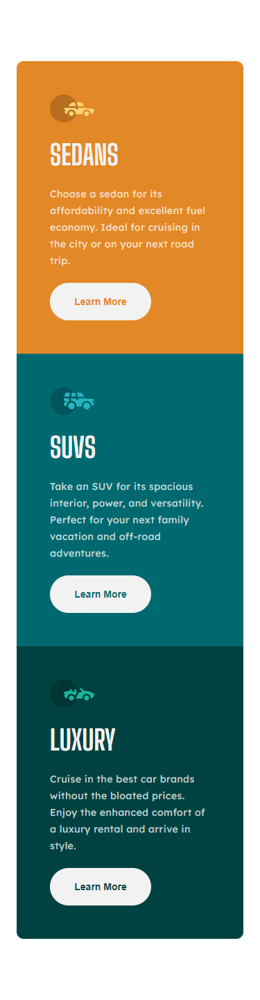
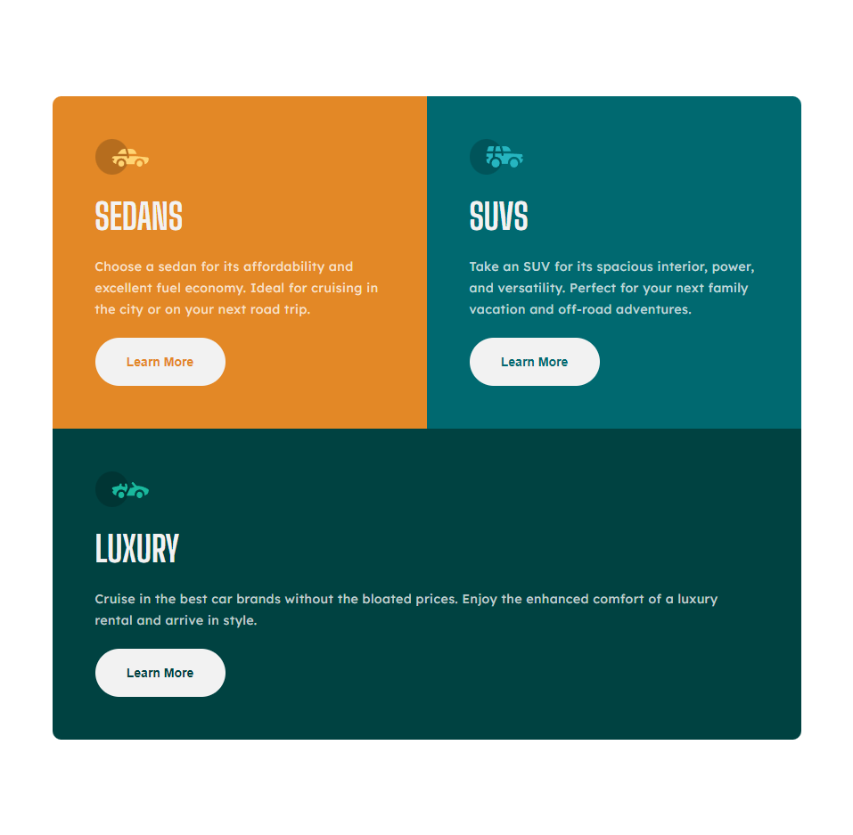
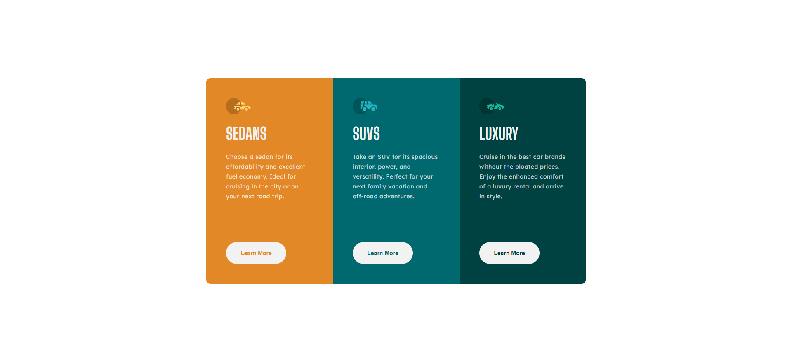

# By Mooenz - 3-column preview card component solution

This is a solution to the [Article preview component challenge on Frontend Mentor](https://www.frontendmentor.io/challenges/3column-preview-card-component-pH92eAR2-).

## Table of contents

- [Overview](#overview)
  - [The challenge](#the-challenge)
  - [Solution screenshot](#solution-screenshot)
    - [Mobile](#nobile)
    - [Tablet](#tablet)
    - [Desktop](#desktop)
  - [Links](#links)
- [My process](#my-process)
  - [Built with](#built-with)
  - [What I learned](#what-i-learned)
  - [Continued development](#continued-development)
- [Author](#author)
- [Acknowledgments](#acknowledgments)

## Overview

### The challenge

Users should be able to:

- View the optimal layout depending on their device's screen size.

### Solution screenshot

#### Mobile

#### Tablet

#### Desktop

### Links

- Solution URL: [Article preview component challenge on Frontend Mentor.](https://www.frontendmentor.io/solutions/html-css-sass-flexbox-mobile-first-and-responsive-design-NUnDYtTzz)
- Live Site URL: [Solution on github pages.](https://mooenz.github.io/frontend-portafolio/3-column-preview-card-component-main/)

## My process

### Built with

- Semantic HTML5 markup
- CSS custom properties
- Scss
- Flexbox
- Mobile-first workflow
- Responsive design

### Continued development

Next challenge im use Sass, css in js.

## Author

- Website - [Mooenz cv](https://mooenz.github.io/curriculum-vitae/)
- Frontend Mentor - [@Mooenz](https://www.frontendmentor.io/profile/Mooenz)
- Twitter - [@MooenzDev](https://www.twitter.com/MooenzDev)

## Acknowledgments

Thanks frontend mentor for this free challenges.
