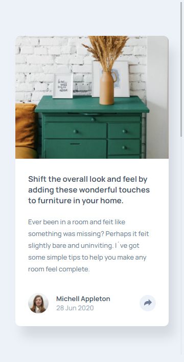

# By Mooenz  - Article preview component solution

This is a solution to the [Article preview component challenge on Frontend Mentor](https://www.frontendmentor.io/challenges/article-preview-component-dYBN_pYFT). Frontend Mentor challenges help you improve your coding skills by building realistic projects. 

## Table of contents

- [Overview](#overview)
  - [The challenge](#the-challenge)
  - [Solution screenshot](#Solution-screenshot)
    - [Mobile](#Mobile)
    - [Mobile whit modal](#Mobile-modal)
    - [Desktop](#Desktop)
    - [Mobile whit modal](#Desktop-modal)
  - [Links](#links)
- [My process](#my-process)
  - [Built with](#built-with)
  - [What I learned](#what-i-learned)
  - [Continued development](#continued-development)
- [Author](#author)
- [Acknowledgments](#acknowledgments)

## Overview

### The challenge

Users should be able to:

- View the optimal layout depending on their device's screen size.

### Solution screenshot

#### Mobile



#### Mobile modal


#### Desktop


#### Desktop modal


### Links

- Solution URL: [Stats preview card component challenge.]()
- Live Site URL: [Solution on github pages.](https://mooenz.github.io/Frontend-portafolio/article-preview-component-master/)

## My process

### Built with

- Semantic HTML5 markup
- CSS custom properties
- Flexbox
- Mobile-first workflow
- Responsive design
- JS vanila

### What I learned

I learned to realice a modal.

```html

```

```css

```


### Continued development

Next challenge im use Sass, css in js.

## Author

- Website - [Mooenz cv](https://mooenz.github.io/Curriculum-Vitae/)
- Frontend Mentor - [@Mooenz](https://www.frontendmentor.io/profile/Mooenz)
- Twitter - [@MooenzDev](https://www.twitter.com/MooenzDev)

## Acknowledgments

Thanks frontend mentor for this free challenges.