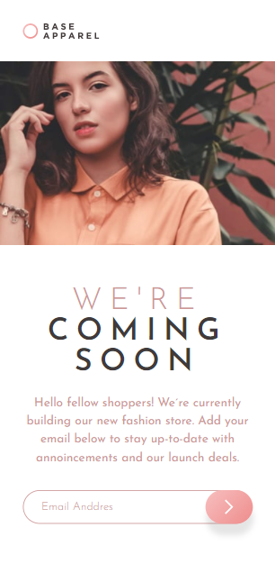
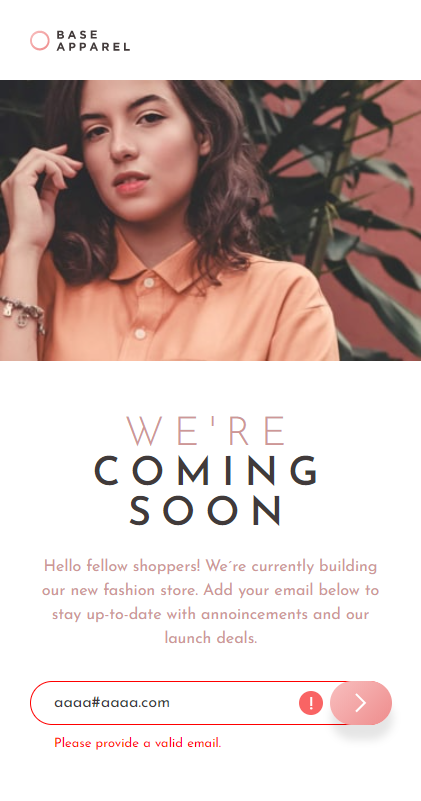
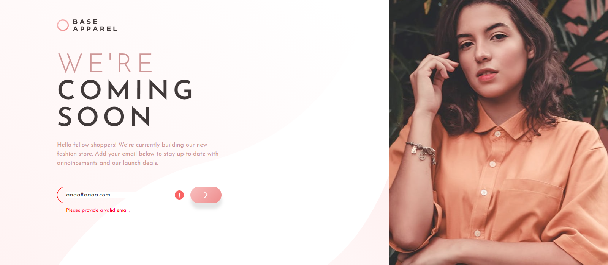

# By Mooenz - Base Apparel coming soon page

This is a solution to the [Base Apparel coming soon page on Frontend Mentor](https://www.frontendmentor.io/challenges/base-apparel-coming-soon-page-5d46b47f8db8a7063f9331a0). 

## Table of contents

- [Overview](#overview)
  - [The challenge](#the-challenge)
  - [Solution screenshot](#Solution-screenshot)
  - [Links](#links)
- [My process](#my-process)
  - [Built with](#built-with)
  - [What I learned](#what-i-learned)
- [Author](#author)
- [Acknowledgments](#acknowledgments)

## Overview

### The challenge

Users should be able to:

- View the optimal layout depending on their device's screen size.

### Solution screenshot

#### Mobile


#### Mobile sucess


#### Mobile error



#### Desktop


#### Desktop sucess


#### Desktop error



### Links

- Solution URL: [Base Apparel coming soon page.](https://www.frontendmentor.io/solutions/html-css-flexbox-and-mobile-first-ZW0uZdcwI)
- Live Site URL: [Solution on github pages.](https://mooenz.github.io/portfolio-frontendmentor/base-apparel-coming-soon-master/)

## My process

### Built with

- Semantic HTML5 markup
- CSS custom properties
- Flexbox
- Mobile-first workflow
- JS Vanila

### What I learned

I learned email validation with regular expressions.

```js
const regex = /^[-\w.%+]{1,64}@(?:[A-Z0-9-]{1,63}\.){1,125}[A-Z]{2,63}$/i;
```
This regular expressions is stack overflow.

## Author

- Website - [Mooenz cv](https://mooenz.github.io/curriculum-vitae/)
- Frontend Mentor - [@Mooenz](https://www.frontendmentor.io/profile/Mooenz)
- Twitter - [@MooenzDev](https://www.twitter.com/MooenzDev)

## Acknowledgments

Thanks frontend mentor for this free challenges.