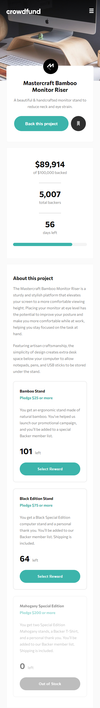
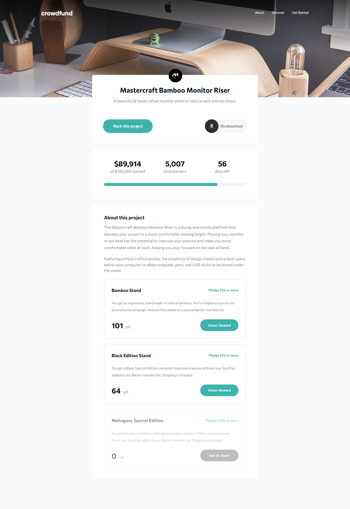

# Mooenz - Crowdfunding product page solution

This is a solution to the [Crowdfunding product page challenge on Frontend Mentor](https://www.frontendmentor.io/challenges/crowdfunding-product-page-7uvcZe7ZR).

## Table of contents

  - [Table of contents](#table-of-contents)
  - [Overview](#overview)
    - [The challenge](#the-challenge)
    - [Solution screenshot](#solution-screenshot)
      - [Mobile](#mobile)
      - [Desktop](#desktop)
    - [Links](#links)
  - [My process](#my-process)
    - [Built with](#built-with)
    - [Continued development](#continued-development)
  - [Author](#author)
  - [Acknowledgments](#acknowledgments)

## Overview

### The challenge

Users should be able to:

- View the optimal layout depending on their device's screen size.

### Solution screenshot

#### Mobile

#### Desktop

### Links

- Solution URL: [Crowdfunding product page solution.](https://www.frontendmentor.io/solutions/html-css-scss-flexbox-mobile-first-responsive-design-and-js-9GsmTqsWN)
- Live Site URL: [Solution on github pages.](https://mooenz.github.io/frontend-portafolio/crowdfunding-product-page-main/)

## My process

### Built with

- Semantic HTML5 markup
- CSS custom properties
- Preprocessor
- Flexbox
- Mobile-first workflow
- Responsive design
- JS vanilla

### Continued development

Next challenges will i use next.js or react or angular.js

## Author

- Website - [Mooenz cv](https://mooenz.github.io/curriculum-vitae/)
- Frontend Mentor - [@Mooenz](https://www.frontendmentor.io/profile/Mooenz)
- Twitter - [@MooenzDev](https://www.twitter.com/MooenzDev)

## Acknowledgments

Thanks frontend mentor for this free challenges.