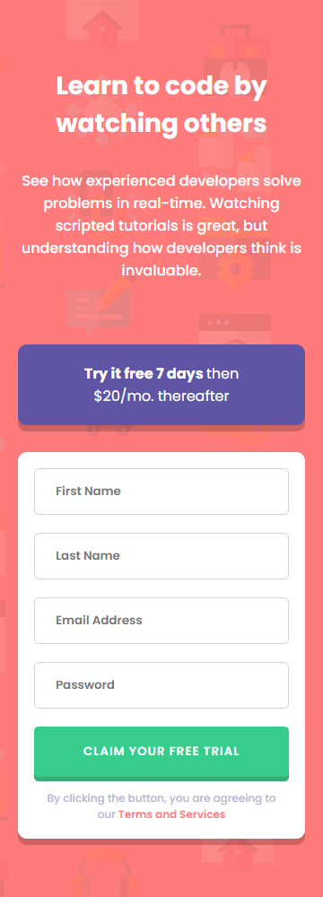
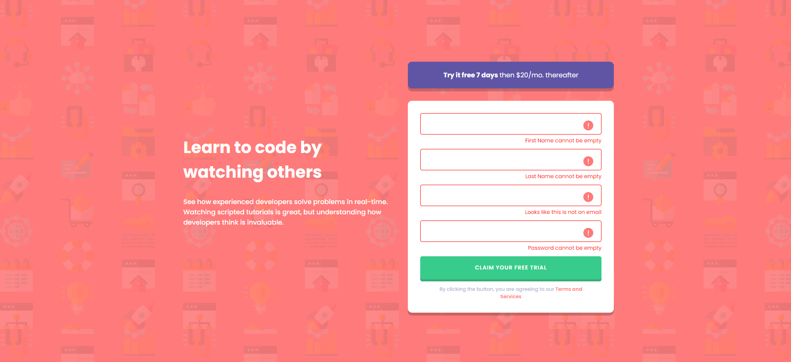

# By Mooenz - Intro component with sign up form solution

This is a solution to the [Intro component with sign up form challenge on Frontend Mentor](https://www.frontendmentor.io/challenges/intro-component-with-signup-form-5cf91bd49edda32581d28fd1). Frontend Mentor challenges help you improve your coding skills by building realistic projects. 

## Table of contents

- [Overview](#overview)
  - [The challenge](#the-challenge)
  - [Solution screenshot](#Solution-screenshot)
    - [Mobile](#Mobile)
    - [Mobile error](#Mobile-error)
    - [Mobile success](#Mobile-success)
    - [Desktop](#Desktop)
    - [Desktop error](#Desktop-error)
    - [Desktop success](#Desktop-success)
  - [Links](#links)
- [My process](#my-process)
  - [Built with](#built-with)
- [Author](#author)
- [Acknowledgments](#acknowledgments)

## Overview

### The challenge

Users should be able to:

- View the optimal layout depending on their device's screen size.

### Solution screenshot

#### Mobile

#### Mobile error

#### Mobile success

#### Desktop

#### Desktop error

#### Desktop success

### Links

- Solution URL: [Intro component with sign up form solution.](https://www.frontendmentor.io/solutions/html-css-js-flexbox-mobile-first-and-responsive-design-N4b1wXiJv)
- Live Site URL: [Solution on github pages.](https://mooenz.github.io/frontend-portafolio/intro-component-with-signup-form-master/)

## My process

### Built with

- Semantic HTML5 markup
- CSS custom properties
- Flexbox
- Mobile-first workflow
- Responsive design
- JS vanila

## Author

- Website - [Mooenz cv](https://mooenz.github.io/Curriculum-Vitae/)
- Frontend Mentor - [@Mooenz](https://www.frontendmentor.io/profile/Mooenz)
- Twitter - [@MooenzDev](https://www.twitter.com/MooenzDev)

## Acknowledgments

Thanks frontend mentor for this free challenges.