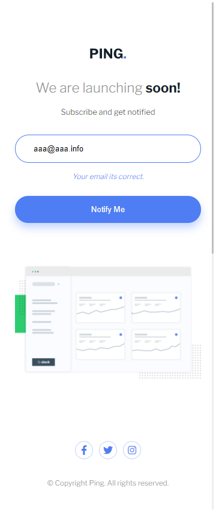
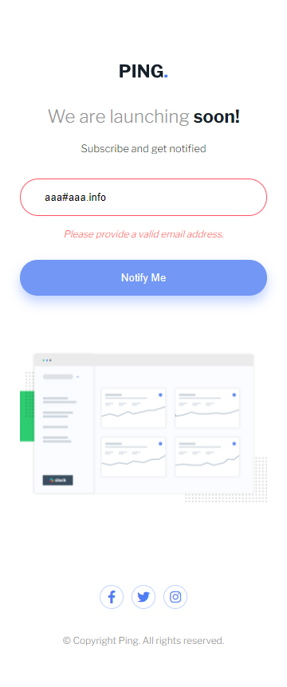
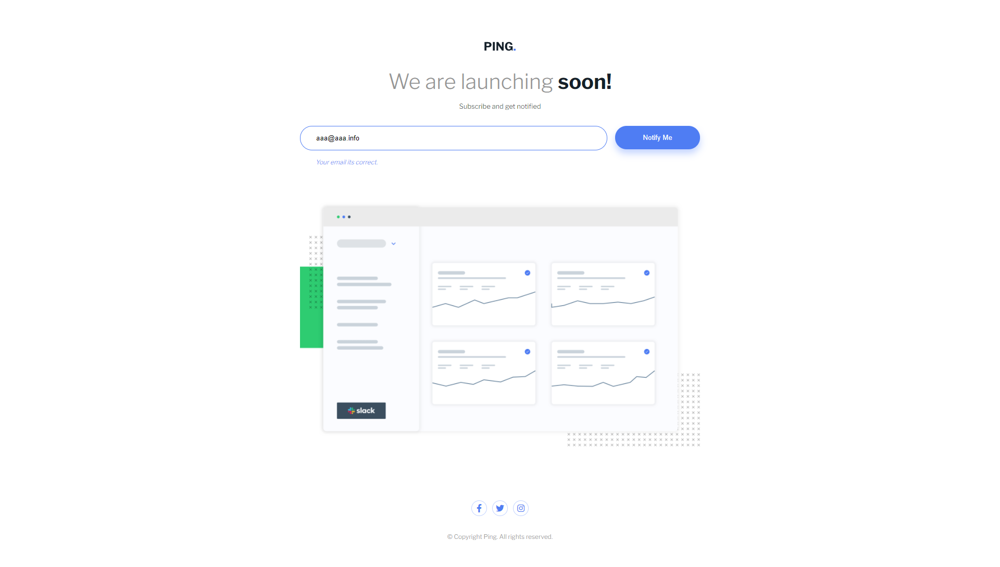
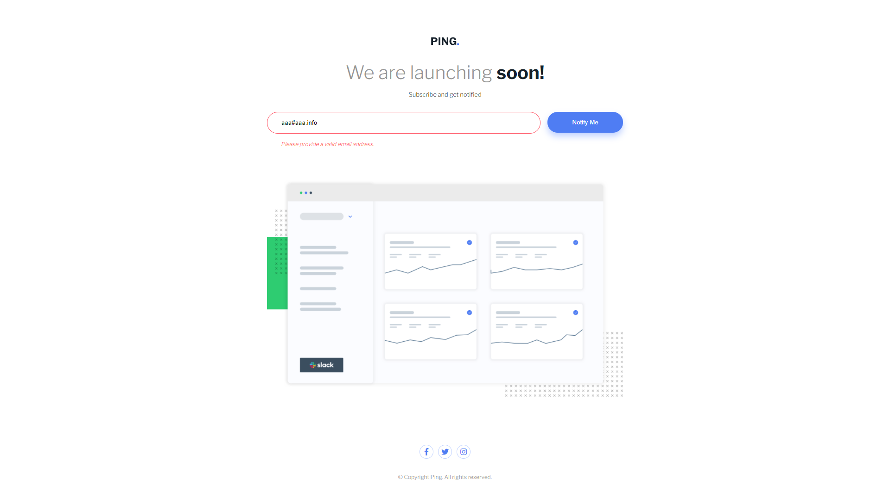

# Mooenz - Ping coming soon page solution

This is a solution to the [Ping coming soon page challenge on Frontend Mentor](https://www.frontendmentor.io/challenges/ping-single-column-coming-soon-page-5cadd051fec04111f7b848da). Frontend Mentor challenges help you improve your coding skills by building realistic projects. 

## Table of contents

- [Overview](#overview)
  - [The challenge](#the-challenge)
  - [Solution screenshot](#Solution-screenshot)  
    - [Mobile](#Mobile)
    - [Mobile success](#Mobile-success)
    - [Mobile error](#Mobile-error)
    - [Desktop](#Desktop)
    - [Desktop success](#Desktop-success)
    - [Desktop error](#Desktop-error)
  - [Links](#links)
- [My process](#my-process)
  - [Built with](#built-with)
  - [What I learned](#what-i-learned)
  - [Continued development](#continued-development)
- [Author](#author)
- [Acknowledgments](#acknowledgments)

## Overview

### The challenge

Users should be able to:

- View the optimal layout depending on their device's screen size.

### Solution screenshot

#### Mobile

#### Mobile success

#### Mobile error

#### Desktop

#### Desktop success

#### Desktop error

### Links

- Solution URL: [Ping coming soon page challenge.](https://www.frontendmentor.io/solutions/html-css-flexbox-mobile-first-responsive-design-vanila-js-S-wNd2haz)
- Live Site URL: [Solution on github pages.](https://mooenz.github.io/frontend-portafolio//ping-coming-soon-page-master/)

## My process

### Built with

- Semantic HTML5 markup
- CSS custom properties
- Flexbox
- Mobile-first workflow
- Responsive design
- JS Vanila

### Continued development

I want to learn Sass and grid layout.

## Author

- Website - [Mooenz cv](https://mooenz.github.io/curriculum-vitae/)
- Frontend Mentor - [@Mooenz](https://www.frontendmentor.io/profile/Mooenz)
- Twitter - [@MooenzDev](https://www.twitter.com/MooenzDev)

## Acknowledgments

Thanks frontend mentor for this free challenges.