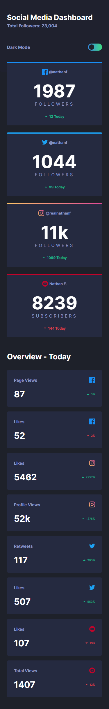
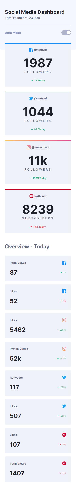
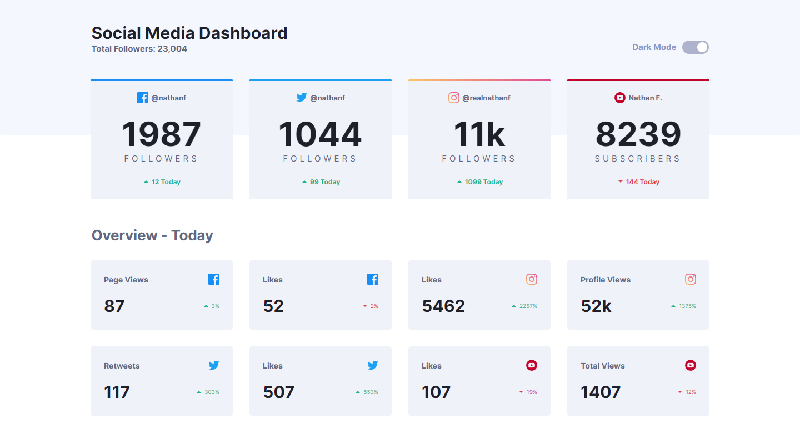

# Frontend Mentor - Social media dashboard with theme switcher solution

This is a solution to the [Social media dashboard with theme switcher challenge on Frontend Mentor](https://www.frontendmentor.io/challenges/social-media-dashboard-with-theme-switcher-6oY8ozp_H).

## Table of contents

- [Overview](#overview)
  - [The challenge](#the-challenge)
  - [Solution screenshot](#solution-screenshot)
    - [Mobile Dark](#mobile-dark)
    - [Mobile Light](#mobile-light)
    - [Desktop Dark](#desktop-dark)
    - [Desktop Light](#desktop-light)
  - [Links](#links)
- [My process](#my-process)
  - [Built with](#built-with)
  - [What I learned](#what-i-learned)
  - [Continued development](#continued-development)
- [Author](#author)
- [Acknowledgments](#acknowledgments)

## Overview

### The challenge

Users should be able to:

- View the optimal layout depending on their device's screen size.

### Solution screenshot

#### Mobile Dark

#### Mobile light

#### Desktop Dark

#### Desktop light

### Links

- Solution URL: [Social media dashboard with theme switcher.](https://www.frontendmentor.io/solutions/html-css-scss-flexbox-mobile-first-and-responsive-design-W_i5d1YJ7)
- Live Site URL: [Solution on github pages.](https://mooenz.github.io/portfolio-frontendmentor/social-media-dashboard-with-theme-switcher-master/)

## My process

### Built with

- Semantic HTML5 markup
- CSS custom properties
- Scss
- Flexbox
- Mobile-first workflow
- Responsive design
- JavaScript

## Author

- Website - [Mooenz cv](https://mooenz.github.io/curriculum-vitae/)
- Frontend Mentor - [@Mooenz](https://www.frontendmentor.io/profile/Mooenz)
- Twitter - [@MooenzDev](https://www.twitter.com/MooenzDev)

## Acknowledgments

Thanks frontend mentor for this free challenges.
