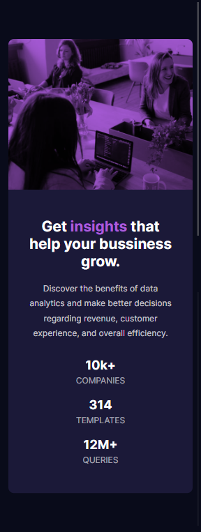

# By Mooenz - Stats preview card component solution

This is a solution to the [Stats preview card component challenge on Frontend Mentor](https://www.frontendmentor.io/challenges/stats-preview-card-component-8JqbgoU62). 

## Table of contents

- [Overview](#overview)
  - [The challenge](#the-challenge)
  - [Solution screenshot](#solution-screenshot)
  - [Links](#links)
- [My process](#my-process)
  - [Built with](#built-with)
  - [What I learned](#what-i-learned)
  - [Continued development](#continued-development)
- [Author](#author)
- [Acknowledgments](#acknowledgments)

## Overview

### The challenge

Users should be able to:

- View the optimal layout depending on their device's screen size.

### Solution screenshot

#### Mobile



#### Desktop


### Links

- Solution URL: [Stats preview card component challenge.](https://www.frontendmentor.io/solutions/html-css-flexbox-mobile-first-and-responsive-design-VRMnqgC1P)
- Live Site URL: [Solution on github pages.](https://mooenz.github.io/frontend-portafolio/stats-preview-card-component-main/)

## My process

### Built with

- Semantic HTML5 markup
- CSS custom properties
- Flexbox
- Mobile-first workflow
- Responsive design

### What I learned

I learned who recreate images like spotify for a background:

```html
<div class="image"></div>
```

```css
.image {
  width: 500px;
  height: 500px;
  background-color: #7bed9f;
  background-image:url(https://the-skyfall.sk/public/storage/uploads/wolf.jpeg);
  background-blend-mode:multiply;
  background-size: cover;
  background-repeat:no-repeat;
}
```
generating this effect:


### Continued development

I want to learn Sass, React and framework backend (Laravel or Express).

## Author

- Website - [Mooenz cv](https://mooenz.github.io/curriculum-vitae/)
- Frontend Mentor - [@Mooenz](https://www.frontendmentor.io/profile/Mooenz)
- Twitter - [@MooenzDev](https://www.twitter.com/MooenzDev)

## Acknowledgments

Thanks frontend mentor for this free challenges.