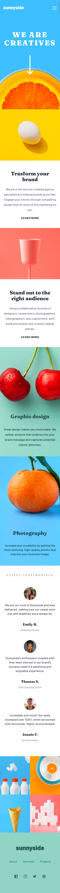
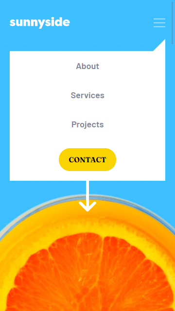

# By Mooenz - Sunnyside agency landing page solution

This is a solution to the [Sunnyside agency landing page challenge on Frontend Mentor](https://www.frontendmentor.io/challenges/sunnyside-agency-landing-page-7yVs3B6ef). Frontend Mentor challenges help you improve your coding skills by building realistic projects.

## Table of contents

- [Overview](#overview)
  - [The challenge](#the-challenge)
  - [Solution screenshot](#solution-screenshot)
  - [Links](#links)
- [My process](#my-process)
  - [Built with](#built-with)
  - [What I learned](#what-i-learned)
  - [Continued development](#continued-development)
- [Author](#author)
- [Acknowledgments](#acknowledgments)

## Overview

### The challenge

Users should be able to:

- View the optimal layout depending on their device's screen size.

### Solution screenshot

#### Mobile




#### Mobile menu



#### Desktop


### Links

- Solution URL: [Sunnyside agency landing page challenge.](https://www.frontendmentor.io/solutions/html-css-js-flexbox-mobile-first-responsive-design-and-sass-BJz9pA1I9)
- Live Site URL: [Solution on github pages.](https://mooenz.github.io/frontend-mentor-portafolio/sunnyside-agency-landing-page-main/)

## My process

### Built with

- Semantic HTML5 markup
- CSS custom properties
- Scss with 
- Flexbox
- Mobile-first workflow
- Responsive design
- Js Vanila

### What I learned

I learned who make a hamburger menu:


its simple, the "menu" in mobile design must have a property:  

```css
.menu {
  display: none;
}
```
the menu is invisible and does not take up space in the html. then alternate with js a class:

```js
const toggle = () => {
  menu.classList.toggle('visible');
}
```

### Continued development

I want to learn React, but i do not know where to start.

## Author

- Website - [Mooenz cv](https://mooenz.github.io/curriculum-vitae/)
- Frontend Mentor - [@Mooenz](https://www.frontendmentor.io/profile/Mooenz)
- Twitter - [@MooenzDev](https://www.twitter.com/MooenzDev)

## Acknowledgments

Thanks frontend mentor for this free challenges.